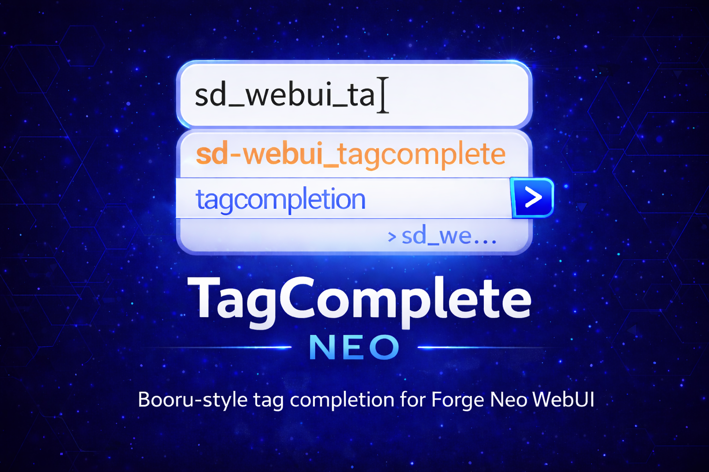

> **Extension for [Stable Diffusion WebUI Forge - Neo](https://github.com/Haoming02/sd-webui-forge-classic/tree/neo)**

# 🏷️ TagComplete Neo

Tag autocompletion for Forge Neo — suggests Danbooru/e621 tags, LoRA/embedding names, wildcards, and chants as you type, with automatic trigger word injection and CivitAI lookup support.

Fork of [a1111-sd-webui-tagcomplete](https://github.com/DominikDoom/a1111-sd-webui-tagcomplete) by [DominikDoom](https://github.com/DominikDoom), maintained here exclusively for Forge Neo. If you are not running Forge Neo, use the [original extension](https://github.com/DominikDoom/a1111-sd-webui-tagcomplete) instead.

---

## 📋 Table of Contents

- [What's New](#-whats-new)
- [Changelog](#-changelog)
- [Roadmap](#️-roadmap)
- [Features](#-features)
- [Installation](#-installation)
- [Tag Lists](#-tag-lists)
- [Credits](#-credits)

---

## 🆕 What's New

### v0.2.1 — Mobile backspace fix & mid-prompt LoRA keywords

- **Backspace no longer lags on mobile** — holding the delete key no longer triggers heavy translation handlers, making deletion smooth even on older phones
- **Mid-prompt LoRA keywords fixed** — when using "After LORA/LyCO" insertion, trigger words now insert correctly even if the LoRA token is in the middle of the prompt (no more overwritten text)
- **Multi-word tag search** — type any word from a tag with underscores and it will be found (e.g. `towards` → `walking_towards_viewer`)

### v0.2.0 — Smoother typing & mobile support

- **Faster tag suggestions** — the autocomplete list now appears more quickly, even with large tag databases like the merged Danbooru/e621 list
- **Much smoother typing on mobile** — typing in the prompt box no longer lags or stutters on phones and tablets
- **Lower input delay** — reduced waiting time between keystrokes and results appearing on screen
- **Indexed search toggle** — new setting to switch between fast prefix-indexed mode and legacy full-scan mode ⭐
- **Status indicator** — a small colored dot in the toolbar shows when the extension is loading (orange), ready (green), or encountered an error (red) ⭐

---

---

## 📖 Changelog

### v0.2.1 — Mobile backspace fix & mid-prompt LoRA keywords
- Backspace no longer triggers heavy translation handlers, eliminating lag when holding delete on mobile
- Fixed "After LORA/LyCO" trigger word insertion corrupting text when the LoRA token is in the middle of the prompt
- Multi-word tag search — type any word from a tag with underscores (e.g. `towards` → `walking_towards_viewer`)

### v0.2.0 — Smoother typing & mobile support
- Tag search significantly faster thanks to an internal prefix index built on load
- Input debounce tightened to keep up with fast typists without causing frame drops
- Reduced DOM and memory churn during dropdown rendering
- Fixed a mouseover listener leak that could accumulate over long sessions
- Startup no longer blocks typing — the tag index is built in small chunks so the prompt box stays responsive while the extension initializes
- Extension parsers now load in parallel, cutting startup time from ~43s to ~7s on slower machines
- Status indicator dot shows loading / ready / error state directly in the Forge Neo toolbar
- Indexed search can be toggled on/off in Settings → Tag Autocomplete
- Fixed crash when inserting tags containing apostrophes
- Fixed broken bold highlight on tags with special characters

### v0.1.2 — Bug fix batch
- Embedding manual refresh (`tac_forceRefreshEmbeddings`) no longer throws `TypeError` on Forge Neo
- LoRA list always populated from filesystem scan; `lora.available_loras` used only for alias enrichment
- `get_embeddings()` resolves symlinks before `relative_to()` — no more crash with linked embedding folders
- `transaction()` in frequency DB initialises `conn = None` before `try` block — prevents `NameError` on failed DB creation

### v0.1.1 — LoRA alias fix
- LoRA/LyCORIS completion now inserts the alias Forge Neo expects, eliminating token blink
- Respects the "Alias from file" / "Filename" setting in Extra Networks

### v0.1.0 — Forge Neo Baseline
- Full Forge Neo / Gradio 4 compatibility
- Booru tags, initialization, and embedding reload fixed
- CivitAI trigger word lookup with SHA256 cache
- "After LoRA/LyCO" insertion option

---

## 🗺️ Roadmap

### v0.1.2 — Bug fix batch ✅
- Embedding manual refresh fixed (Forge Neo removed `force_reload` kwarg) ✅
- LoRA list always populated at startup ✅
- Symlinked embeddings no longer crash on model load ✅
- Frequency database `NameError` on first run fixed ✅

### v0.1.1 — LoRA alias fix ✅
- LoRA/LyCORIS token matches Forge Neo's expected alias ✅

### v0.1.0 — Forge Neo Baseline ✅
- Forge Neo / Gradio 4 compatibility ✅
- Booru tag display fixed (Gradio 4 selectors) ✅
- Reliable re-initialization after WebUI reconnect ✅
- Embedding reload hardened ✅
- Extension resilience after Forge updates ✅
- CivitAI trigger word lookup with SHA256 cache ✅
- "After LoRA/LyCO" insertion option ✅

### v0.2.1 — Mobile backspace fix & mid-prompt LoRA keywords ✅
- Backspace lag eliminated (updateRuby skipped on delete) ✅
- Mid-prompt "After LORA/LyCO" trigger word insertion fixed ✅
- Multi-word tag search (any word of a multi-word tag) ✅

### v0.2.0 — Smoother typing & mobile support ✅
- Prefix-indexed tag search (toggleable) ✅
- Tighter debounce and delete-event skipping ✅
- DOM batching + deferred rendering ✅
- Parallel extension loading (43s → ~7s startup) ✅
- Status indicator dot in toolbar ✅
- Apostrophe crash and highlight fixes ✅
- Mobile typing no longer lags or stutters ✅

### v0.3.0 — Tag data & relevance (planned)
- Update Danbooru and e621 tag lists with current data
- Better tag coverage for Pony / NoobAI / Illustrious models
- Sort suggestions by relevance to tags already in the prompt
- Use multiple tag list files simultaneously

### v0.4.0 — Smart matching (planned)
- Fuzzy matching (e.g. `detco` → `detached_collar`)
- Auto-switch tag list based on the loaded model

### v1.0.0 — Stable (planned)
- All known issues resolved

---

## 🎯 Features

> ⭐ = added or fixed in this Neo fork · everything else is original work by [DominikDoom](https://github.com/DominikDoom)

### 🏷️ Tag Autocompletion

- **Instant suggestions** as you type, sourced from Danbooru, e621, or merged lists
- **Indexed search** — built-in prefix index for near-instant filtering on large tag lists; can be disabled in settings if needed ⭐
- **Keyboard navigation** — arrow keys, Tab, Enter, Escape, all configurable
- **Tag color coding** by category, with post count for relevance
- **Alias and translation search** — find tags by their alternate names or translated terms
- **Frequency sorting** — remembers your most-used tags and promotes them to the top ⭐
- **Status indicator** — colored dot in the toolbar shows when the extension is loading, ready, or in error state ⭐

### ➕ Extra Networks

- **LoRA and LyCORIS autocomplete** triggered by `<`
- **Embedding autocomplete** triggered by `<e:`
- **Thumbnail preview** in the completion popup
- **Correct alias insertion** — uses the same identifier Forge Neo expects (`ss_output_name` or filename, respecting your Extra Networks setting) so tokens never blink ⭐
- **Trigger word injection** on LoRA selection — inserts activation keywords automatically
  - Fetches from CivitAI if not set locally ⭐
  - Cached by SHA256 — only re-fetched when the model file changes ⭐
  - Configurable position: Start of prompt, End of prompt, Before or After the LoRA token ⭐

### ✳️ Wildcards

- **Wildcard file autocomplete** triggered by `__`
- **Nested folder support**
- **YAML wildcard format** (UMI-compatible)

### 🪄 Chants

- **Prompt preset completion** for longer phrase templates stored in JSON files
- Triggered by `<c:` or `<chant:`

---

## 📦 Installation

1. Open Forge Neo WebUI
2. Go to **Extensions** → **Install from URL**
3. Paste: `https://github.com/eduardoabreu81/sd-webui-tagcomplete-neo`
4. Click **Install** and reload the WebUI

> ⚠️ This extension requires **Forge Neo**. It will not work on Automatic1111 or Forge Classic.

---

## 🗂️ Tag Lists

| File | Source | Best for |
|---|---|---|
| `danbooru.csv` | Danbooru top-100k | Anime models (SD 1.5, SDXL) |
| `danbooru_2025.csv` | Danbooru updated 2025 | Anime models (SD 1.5, SDXL) |
| `e621.csv` | e621 top-100k | Furry / anthro models |
| `e621_sfw.csv` | e621 SFW subset | Furry / anthro models (safe) |
| `danbooru_e621_merged.csv` | Merged + unified categories | Pony, NoobAI, Illustrious |
| `derpibooru.csv` | Derpibooru tags | MLP / cartoon models |
| `extra-quality-tags.csv` | Curated set | Quality booster tags |
| `EnglishDictionary.csv` | English dictionary | Photorealistic / non-booru models |
| `demo-chants.json` | Demo presets | Prompt templates |
| `noob_characters-chants.json` | NoobAI character presets | Character-based prompts |

To switch lists, change **Tag filename** in **Settings → Tag Autocomplete**.

---

## 📄 Credits

- **[a1111-sd-webui-tagcomplete](https://github.com/DominikDoom/a1111-sd-webui-tagcomplete)** by DominikDoom — original project, all core functionality
- **[sd-webui-tagcomplete-neo](https://github.com/eduardoabreu81/sd-webui-tagcomplete-neo)** by [Eduardo Abreu](https://github.com/eduardoabreu81) — Forge Neo fork
- **[Forge Neo](https://github.com/Haoming02/sd-webui-forge-classic/tree/neo)** by Haoming02

---

## 📜 License

MIT — see [LICENSE](LICENSE)

---

Made with ❤️ for the Stable Diffusion community

**[Report Bug](https://github.com/eduardoabreu81/sd-webui-tagcomplete-neo/issues)** • **[Request Feature](https://github.com/eduardoabreu81/sd-webui-tagcomplete-neo/issues)** • **[☕ Ko-fi](https://ko-fi.com/eduardoabreu81)**

